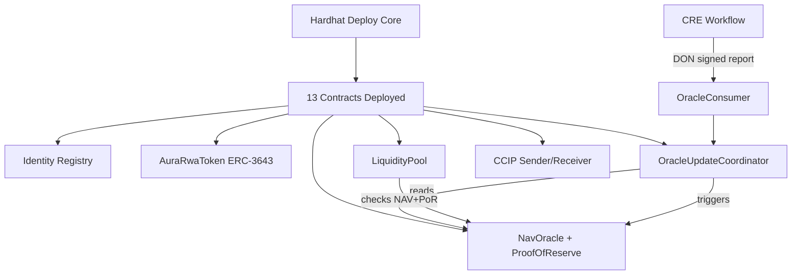

# AURA Hardhat

RWA (Real-World Asset) protocol on Ethereum Sepolia built with Hardhat. Features ERC-3643 compliance, NAV/PoR oracles, Chainlink Automation, and Chainlink CCIP cross-chain bridging.

**Documentation:**
[Contract Addresses](./addr.md) · [Interaction Guide](./scripts/INTERACTIONS.md) · [Verification Guide](./VERIFY.md) · [CRE Workflows](./cre-workflows/README.md)

## Stack

| Package | Version |
|---|---|
| Hardhat | `2.22.17` |
| `@openzeppelin/contracts` | `5.4.0` |
| `@chainlink/contracts` | `1.5.0` |
| `@chainlink/contracts-ccip` | `1.6.2` |
| Node | `20.x` |

---

## Setup

```bash
# 1. Install dependencies
npm install

# 2. Copy and fill in your .env
cp .env.example .env
# → Fill in PRIVATE_KEY, RPC URLs, and ETHERSCAN_API_KEY
```

---

## Deployed Contracts (Ethereum Sepolia)

See [`addr.md`](./addr.md) for the full table. Key addresses:

| Contract | Address |
|---|---|
| Identity Registry | `0xC9CcbF9d29eE599B6A1790112439387a235c0eAe` |
| Compliance Registry | `0xa1549874980F2f563d304E995a0cD9C5A7291300` |
| **AURA RWA Token** | `0xb99329522A44A489eaB1138ED4266F260c13f5D6` |
| NAV Oracle | `0xaf9E56B5E72C0F159c853DbEdd02245B11133CBF` |
| Proof of Reserve | `0xE5D2FaCF85E358A71FaA3d0F775c4CdEB1dccBfD` |
| Liquidity Pool | `0xb88621d4011eE95f09410122EFC503aa161e3d77` |
| Oracle Coordinator | `0x98714BFfbd70B2DB37214E104e8BD5EF86242080` |

> **Pool ID:** `0x415552415f504f4f4c...`  
> **Asset ID:** `0x415552415f41535345...`

---

## Commands

```bash
npm run compile        # Compile all contracts
npm run test           # Run all tests
```

### Deploy — Local (Hardhat)

```bash
npx hardhat deploy-core --network hardhat
```

Spins up a fresh in-memory chain, deploys all 13 contracts, and prints their addresses. No wallet or ETH needed.

### Deploy — Sepolia

```bash
npx hardhat deploy-core --network sepolia
```

Requires `PRIVATE_KEY`, `ETHEREUM_SEPOLIA_RPC_URL`, `SEPOLIA_ROUTER`, `SEPOLIA_LINK`, and `FUJI_CHAIN_SELECTOR` in `.env`. After deployment, copy the printed addresses into your `.env`.

---

## Interaction Scripts (Step-by-step)

Run these in order on Sepolia. See [`scripts/INTERACTIONS.md`](./scripts/INTERACTIONS.md) for details.

```bash
# 1. Verify your wallet identity
npx hardhat run scripts/interactions/01-setup-identity.ts --network sepolia

# 2. Update NAV and Proof of Reserve oracles
npx hardhat run scripts/interactions/02-update-oracles.ts --network sepolia

# 3. Mint 1,000 RWA tokens to your wallet
npx hardhat run scripts/interactions/03-mint-tokens.ts --network sepolia

# 4. Deposit tokens into the Liquidity Pool
npx hardhat run scripts/interactions/04-invest-pool.ts --network sepolia

# 5. Deploy a new AuraRwaToken (e.g. for a new issuer)
npx hardhat run scripts/interactions/deploy-token.ts --network sepolia

# 6. Link a deployed token to the NAV Oracle
npx hardhat run scripts/interactions/05-link-nav-oracle.ts --network sepolia
```

---

## Contract Verification

Verify any deployed contract on Etherscan with one command:

```bash
npx hardhat verify-contract --address <CONTRACT_ADDRESS> --network sepolia
```

The task auto-detects the contract name and constructor args from your `.env`. See [`VERIFY.md`](./VERIFY.md) for all example commands.

---

## How NAV Price Works on Etherscan

The `AuraRwaToken` exposes a `navPrice()` view function that reads directly from the `NavOracle`. On Etherscan:

1. Go to your token contract → **Contract** → **Read Contract**
2. Click `navPrice()`
3. Returns `nav` (raw uint256 with 18 decimals, e.g. `1010000000000000000` = **1.01**)

To convert: `nav / 10^18`

---

## Multi-Issuer Model

Each new RWA issuer (gold, real estate, bonds, etc.) deploys their own token but **shares the same oracle infrastructure**:

```
NavOracle (one contract)
├── AURA_POOL  → NAV: 1.01
├── GOLD_POOL  → NAV: 1980.00
└── BLDG_POOL  → NAV: 1.05
```

Steps for a new issuer:
1. `npx hardhat run scripts/interactions/deploy-token.ts` — deploys fresh token
2. Call `setNavOracle(existingNavOracleAddress, "MY_POOL_ID")` — links to shared oracle
3. Oracle coordinator submits NAV data under their unique pool ID

---

## Architecture



### CRE Automation

```bash
# After deploying, update cre-workflows/*/config.json with your addresses then:
cre workflow deploy nav-por-workflow --target staging
cre workflow deploy ccip-transfer-workflow --target staging
```

See [cre-workflows/README.md](./cre-workflows/README.md) for full CRE setup.

---

## Contracts

| File | Purpose |
|---|---|
| `IdentityRegistry.sol` | ERC-3643 KYC/AML identity store |
| `ERC3643ComplianceRegistry.sol` | Transfer compliance check |
| `AuraRwaToken.sol` | ERC-20 + ERC-3643 RWA token with `navPrice()` |
| `NavOracle.sol` | Stores NAV per pool ID |
| `ProofOfReserve.sol` | Stores PoR per asset ID |
| `LiquidityPool.sol` | Deposit RWA tokens, receive pool shares (AURAPS) |
| `OracleUpdateCoordinator.sol` | Orchestrates NAV + PoR updates |
| `AutomationFacade.sol` | Chainlink Automation trigger |
| `AuraCcipSender.sol` | CCIP bridge Sepolia → Fuji |
| `AuraCcipReceiver.sol` | CCIP bridge receiver on Fuji |
| `OracleConsumer.sol` | CRE workflow oracle entry point |
| `CcipConsumer.sol` | CRE workflow CCIP entry point |
| `mocks/MockOracleProvider.sol` | Mock data source for testnet |
