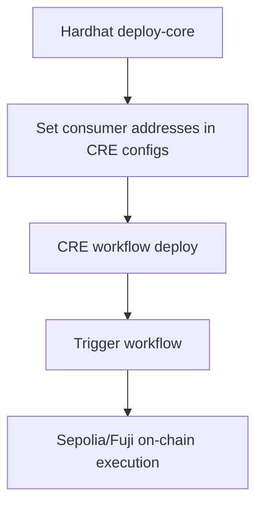

# CRE Workflows

## Flows
### CRE Focus


### Combined with Hardhat


This folder contains the two recommended workflows:

1. `nav-por-workflow`
- Purpose: submit NAV + PoR updates to `OracleConsumer.onReport(...)`.
- Report payload shape: `(bytes32 poolId, bytes32 assetId, uint256 nav, uint256 reserve, uint256 timestamp, bytes32 reportId)`.

2. `ccip-transfer-workflow`
- Purpose: submit transfer instructions to `CcipConsumer.onReport(...)`.
- Report payload shape: `(address receiver, uint256 amount, bytes data)`.

## Setup

1. Copy secrets template:
```bash
cp secrets.yaml.example secrets.yaml
```

2. Configure each workflow:
```bash
cp nav-por-workflow/config.json.example nav-por-workflow/config.json
cp ccip-transfer-workflow/config.json.example ccip-transfer-workflow/config.json
```

3. Install workflow deps (Bun recommended by CRE templates):
```bash
cd nav-por-workflow && bun install && cd ..
cd ccip-transfer-workflow && bun install && cd ..
```

## Local simulation

### NAV + PoR
```bash
cre workflow simulate nav-por-workflow \
  --target local-simulation \
  --trigger-index 0 \
  --non-interactive \
  --http-payload @./nav-por-workflow/http_trigger_payload.json
```

### CCIP transfer instruction
```bash
cre workflow simulate ccip-transfer-workflow \
  --target local-simulation \
  --trigger-index 0 \
  --non-interactive \
  --http-payload @./ccip-transfer-workflow/http_trigger_payload.json
```

## Staging / testnet

After deploying contracts on Sepolia (and configuring addresses in workflow config files):

```bash
cre workflow deploy nav-por-workflow --target staging
cre workflow deploy ccip-transfer-workflow --target staging
```

Then trigger via your configured HTTP capability payloads.

## Contract wiring required

- `OracleUpdateCoordinator` must grant `ORACLE_UPDATER_ROLE` to `OracleConsumer`.
- `OracleConsumer` should authorize CRE forwarder address for `REPORTER_ROLE`.
- `CcipConsumer` should authorize CRE forwarder address for `REPORTER_ROLE`.
- `CcipConsumer` must be funded/approved as needed for sender-side bridge path.
